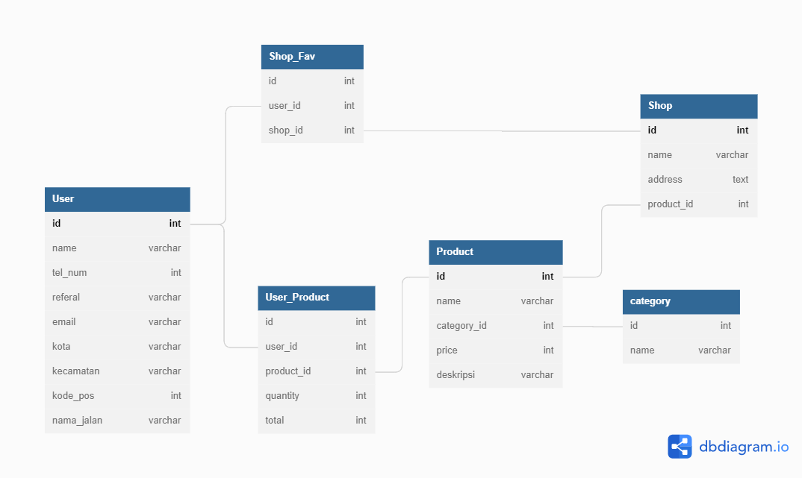

## Project Setup
yarn or npm install  
npm i -g sequelize-cli  
npx sequelize-cli db:create  
npx sequelize-cli db:migrate  
npx sequelize-cli db:seed:all

## Run
run this command line in 2 terminal  
yarn ts  
yarn dev

## Desain Database

## API Spec
### Get All Products
{{protocol}}://{{host}}/products
### Get Product by id
{{protocol}}://{{host}}/products/search?id={{product_id}}
### Get Products by category
{{protocol}}://{{host}}/products/search?category={{category_id}}
### Get All Category
{{protocol}}://{{host}}/categories
#### Register
{{protocol}}://{{host}}/auth/register
#### Login
{{protocol}}://{{host}}/auth/login
payload auth = {
    "name" : {{yourname}},
    "tel_num" : {{your_telpNumber}},
    "referal" : {{referal_code}}, // allow null
}
